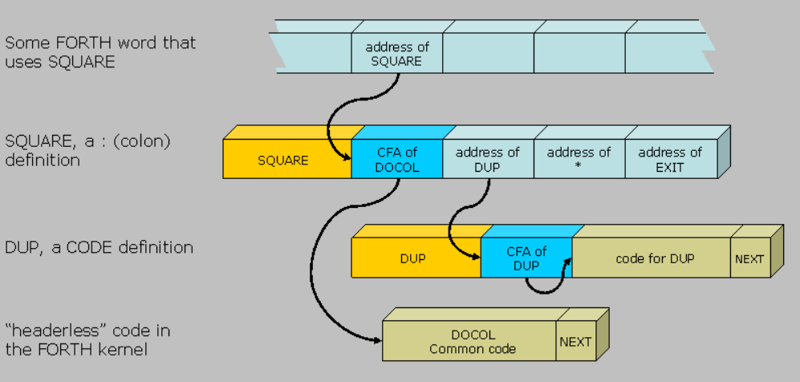

# Capitulo 7 

Nesse capítulo existirão alguns desafios rodeando os exercícios propostos pelo autor. Entre eles um interpretador de Forth e a teoria sobre máquinas de estado e modelos de computação.

## 7.1 Máquinas de estado finitas

As máquinas de estado finitas (FSM - Finite State Machines) são uma abstração de um "autômato finito determinístico", que é uma forma de entender o fluxo de ação de um programa com base na lógica usada para interpretar cada input.

### 7.1.1 Definição

A descrição dessa máquina tange as seguintes propriedades:

1. Possui um conjunto de estados
2. Possui um alfabeto (conjuntos de símbolos para input)
3. Possui um estado inicial selecionado
4. Possui um ou mais estados finais selecionados
5. Possui regras de transição de estados. Cada regra consome um símbolo do alfabeto da seguinte forma: "Se o autômato estiver em um estado S e um símbolo C de entrada ocorrer, o próximo estado será Z"

Se o estado atual não possuir nenhuma regra para o símbolo de entrada atual o autômato possuirá comportamento "indefinido".

Esse conceito será abordado pensando nos seus casos "bons". Consideraremos todos os casos de comportamento indefinido como errôneos, indo para um estado de erro especial.

O autor cita uma situação em que é feito um autômato para a transição de estados A, B e C. Como esse conteúdo já foi abordado em matérias como Sistemas Digitais, do meu curso, não vou entrar em detalhes com figuras ou exemplos abstratos.

### 7.1.2 Exemplo: paridade de bits

Aqui o autor cita um exemplo de cálculo de paridade de bits, em que, a partir da leitura de uma string binária (zeros e uns), se determina a transição de estados entre um número impar de 1's para um número par de 1's a partir da leitura de um '1':

```asm

inicio - A: input 0 > A
            input 1 > B
            
       - B: input 0 > B
            input 1 > A

; Se o número for lido e o estado estiver em A, ele é par
; Caso contrário, ele é impar
```

### 7.1.3 Implementação em linguagem Assembly

O autor dá alguns insights de como criar um autômato desses em ASM. Para isso ele nos diz para:

1. Deixar o autômato projetado completo em papel: todo estado deve ter regras de transição para **qualquer** símbolo da entrada ou uma saída padrão de erro para caso não pensados ("regra-else")
2. Implementar uma rotina para obter o símbolo de entrada. Esse símbolo não é meramente um caractere, pode ser outros tipos de eventos globais
3. Para cada estado, devemos:
    - Criar um rótulo
    - Chamar a rotina de leitura de entrada
    - Casar o símbolo de entrada com os descritos nas regras de transição de estados e passar para os estados correspondentes
    - Tratar todos os demais símbolos com a regra-else

No exemplo do livro, temos a seguinte transição de estados:

```asm

inicio: A
fim: D
erro: E

A:  input "+" > B
    input "-" > B
    input 0..9 > C
    else  > E
B:  input 0..9 > C
    else > E
C:  input 0..9 > C
    input "\0" > D
    else > E

```

Seguindo esse exemplo, em `automaton_example_bits.asm`:

```asm
section .text

; getsymbol é uma rotina para let um símbolo (ex: stdin) em AL (de RAX)

_A: 
    call getsymbol
    cmp al, '+'
    je _B
    cmp al, '-'
    je _B

    cmp al, '0'
    jb _E
    cmp al, '9'
    ja _E
    jmp _C

_B: 
    call getsymbol
    cmp al, '0'
    jb _E
    cmp al, '9'
    ja _E
    jmp _C

_C:

    call getsymbol
    cmp al, '0'
    jb _E
    cmp al, '9'
    ja _E
    test al, al
    jz _D
    jmp _C

_D: 
    ; rotina de tratamento de sucesso

_E:
    ; rotina de tratamento de erros

```

Vemos nitidamente a transição de estados a partir dos 'jumps' no código.

### 7.1.4 Importância prática

Nem todos os programas podem ser transformados em máquina de estados finitas, pois esse tipo de abordagem dificulta tratamento de programas que usam recursão (que possui iterações inderteminadas), por exemplo.

C e Assembly são linguagens com máquinas de Turing completas, o que significa que são mais expressivas e podem ser usadas para resolver uma variedade maior de problemas.

Esse tipo de autômato é usado para sistemas embarcados, que possui funcionalidades pré-definidas, ou para protocolos, que possui sequências de dados para serem enviados.

Outro aspecto importante desses autômatos é a presença de estados inalcançáveis a partir de outro estado (que é importante para sistemas que requerem alta confiabilidade).

### 7.1.6 Expressões regulares

Vulgo (RegEx - Regular Expressions), constituem uma forma de codificar autômatos finitos. Elas declaram padrões textuais para substituí-los. A maioria dos editores de textos (VSCode, por exemplo) possuem elas implementadas. O autor nos instrui a tomar como exemplo o `egrep` - utiliátio do Linux. Ele segue as seguintes regras:

Uma expressão regular _R_, pode ser:

1. Uma letra
2. Uma sequênciade duas expressões regulares: _R Q_
3. Metassímbolos _^_ e _$_ que fazem correspondências no início e no final da linha
4. Um par de parênteses de agrupamento contendo uma expressão regular: _(R)_
5. Uma expressão OR: _R | Q_
6. _R*_ representa zero ou mais repetições de _R_
7. _R+_ representa uma ou mais repetições de _R_
8. _R?_ representa zero ou uma repetição de _R_
9. Um ponto corresponde a qualquer caractere: _._
10. Colchetes representam um intervalo de símbolos, por exemplo, _[0-9]_ é equivalente a _(0|1|2|3|4|5|6|7|8|9)_

Após seguir com alguns exemplos de RegEx, o autor nos traz as duas abordagens que alguns motores de RegEx usam no geral:

1. Utilizam sequências de símbolos descritas para tratar a expressão. Por exemplo ao tratar `ab` com a expressão `aa?a?b`:
    - Tentativa com `aaab` - falha
    - Tentativa com `aab` - falha
    - Tentativa com `ab` - sucesso

    Isso nos traz diferentes ramos de decisão em cima de uma expressão ou até que todas as decisões levem à falha.
    Essa abordagem é rápida e fácil de implementar, mas possui um cenário de pior caso em que a complexidade pode aumentar exponencialmente. Vamos tentar tratar `aaaaaaaa (...) aaaaa` ("a" repetido _n_ vezes) com `a?a?a?a?a? (...) a?a?aaaaaaaa (...) aaaaa` (repetição de "a?" _n_ vezes, seguido de "a" repetido _n_ vezes).

    Isso resultará em inúmeras comparações (2^n comparações até achar o resultado). Isso é um custo computacional muito alto. Esses casos são chamados de "casos patológicos".

2. Constroem uma FSM baseada em expressão regular. O seu nome é **NFA** (Non-deterministic Finite Automaton), que se opõe ao DFA (Deterministic Finite Automaton). Elas podem ter várias regras para o mesmo estado e para o mesmo símbolo de entrada. Isso resultará em mais de um estado simultâneo, resultando em um "macro-estado" conjunto entre todos os "estados atuais" do autômato. Para construir um autômato para RegEx usando uma NFA, podemos seguir as seguintes regras:

    - Um caractere corresponden a um autômato, que aceita uma string com um caractere desse tipo:
        ```asm
            inicio: A

            A - input: caractere > B
        ```
    
    - Podemos ampliar o alfabeto com símbolos adicionais, que colocaremos no final/início de cada linha, desse modo _^_ e _$_ serão como qualquer outro símbolo
    - Parênteses de agrupamento premitem aplicar regras aos grupos de símbolos. São usados somente para um parsing correto das expressões regulares (fornecem informações estruturais para a construção de um autômato correto)
    - OR corresponde à combinação de dois NFAs, mesclando seus estados (e gerando um outro "macro-estado") (vide figura 7.6 do livro)
    - Um asterisco corresponde a uma transição especial para o próprio estado e a um "else" para um estado intermediário à presença de outro caractere (vide figura 7.7 do livro)
    - A interrogação é implementada de maneira semelhante ao asterisco. _R+_ é implementado como _RR*_

## 7.2 Máquina de Forth

Criada por Charles Moore, é muito didática e usada para softwares embarcados. Vamos criar um dialeto próprio e simples para fazer nosso interpretador/compilador de Forth.

### 7.2.1 Arquitetura

A máquina de Forth possui duas pilhas (uma de dados e uma de endereços de retorno) com uma memória linear. Ela possui um parâmetro chamado célula que possui tamanho igual à palavra da máquina alvo (nosso caso, 8 bytes). 

Os programas são formados por uma sequência de palavras divididas por espaços ou por quebra de linhas. Elas são executadas consecutivamente. Palavras inteiras são pushes na pilha de dados, por exemplo: para push de 42, 18 e 9, digitamos apenas `42 18 9`. 

Há três tipos de palavras em Forth:

1. Palavras inteiras
2. Palavras nativas (escritas em ASM)
3. Palavras de dois-pontos (escritas em Forth como uma sequência de outras palavras Forth)


A pilha de retorno é necessária para que seja possível retornar das palavras de dois-pontos. A maioria das palavras manipula a pilha de dados (a qual tomaremos como padrão caso seja falado de "pilha").

As palavras aceitam seus argumentos da pilha e fazem push do resultado nela. Todas as instruções que atuam na pilha consomem seus operandos. Por exemplo: `+`, `-`, `*` e `/` consomem dois operandos da pilha cada e devolvem o resultado para a pilha. Um programa `1 4 8 8 + * +` calcula a expressão `(8 + 8)*4 + 1`. 

Na nossa conveção, o segundo operando é extraído da pilha antes, tornando `1 2 -` avaliado como `-1` e não como `1`.

A palavra `:` é usada para definir novas palavras. Ela é seguida do nome da nova palavra e de uma lista de outras palavras terminada por `;`. Tanto o `;` quanto os `:` são palavras por si só e, por causa disso, devem ser seguidas e espaços.

Uma palavra `sq` que aceite um argumento da pilha e faça um push do seu quadrado de volda teria a seguinte sintaxe: `: sq dup * ;`.

A palavra `dup` duplica o topo da pilha. 

Para descrever aços de palavras em Forth, é comum usar `diagramas de pilha`: 

```fs
swap (a b -- b a)
```

Em que esses parênteses são como se fossem comentários. Já a palavra `rot` posiciona o 3o elemento da pilha no topo da seguinte maneira:

```fs
rot (a b c -- b c a)
```

### 7.2.2 Trace de um exemplo de um programa em Forth

No arquivo `forth_disc.fs`, vamos calcular o discriminante da função quadrática x^2 + 2x + 3 = 0:


```fs
: sq dup * ;
: discr rot 4 * * swap sq swap - ;
1 2 3 discr
```

Na tradução feita, podemos interpretar o código com a seguinte execução para `discr`:

```fs
comando --- pilha


-------     (a b c)


rot         ( b c a )
4           ( b c a 4 )
*           ( b c (4*a) )
*           ( b (4*a*c) )
swap        ( (4*a*c) b )
sq          ( (4*a*c) (b*b) )
swap        ( (b*b) (4*a*c) )
-           ( ((b*b) - (4*a*c)) )
```

Resultando numa pilha final de `-8` para a, b e c `1 2 3`.

### 7.2.3 Dicionário 

É a parte de Forth que armazena as definições das palavras. Cada palavra tem um cabeçalho seguido de uma sequência de outras palavras.
Cada cabeçalho armazena o endereço da palavra anterior com uma string que corresponde à entrada e algumas flags. Já vimos esse tipo de dicionário no capítulo 5. Aqui vai um exemplo de entrada do dicionário para a palavra `discr`:

- [0:7] Endereço da entrada anterior
- [8] "d"
- [9] "i"   
- [10] "s"
- [11] "c"
- [12] "r"
- [13] "0"
- [14] "F"

* "F" seria uma flag

### 7.2.4 Como as palavras são implementadas

Há três maneiras de implementar palavras:

- Código com encadeamento indireto (indirect threaded code)
- Código com encadeamento direto (direct threaded code)
- Código com encadeamento por sub-rotina (subroutine threaded code)

Usaremos o método clássico (indireto), que necessita de duas células especiais ('registradores de Forth'):

- PC: aponta para o próximo comando Forth (que por sua vez é um endereço de um endereço do código de implementação ASM da respectiva palavra), um ponteiro para um código Assembly executável com dois níveis de acesso indireto.
- W: usado para palavras não nativas. Quando a palavra iniciar sua execução,  esse registrador apontará para a sua primeira palavra.

Esses dois registradores podem ser implementados com o uso de um registrador diverdade, podendo ter seus conteúdos armazenados na memória.

Para exemplificar o uso dessa função, observe a seguinte imagem:



Note que, para a função `SQUARE`, há ponteiros para as implementações de `docol` (dois-pontos) e para `dup`, que são entradas-padrão do dicionário. Elas são seguindas da instrução `jmp` para a próxima entrada a ser executada. Esses ponteiros são chamados de *tokens de execução*. O arquivo `forth_dict_simple.asm` contém a implementação de palavras-padrão `w_plus` e `w_dup`, além de uma palavra de dois-pontos `w_sq`:

```asm
section .data

w_plus:
    dq 0        ; ponteiro para a palavra anterior do dicionário (zero)
    db '+', 0   ; nome da palavra
    db 0        ; não há flags

xt_plus:        ; token de execução para 'plus' igual ao seu endereço de implementação
    dq plus_impl

w_dup:
    dq w_plus
    db 'dup', 0
    db 0

xt_dup:
    dq: dup_impl

w_sq:
    dq w_dup
    db 'sq', 0
    db 0
    dq docol    ; endereço de docol (nível de acesso indireto)
    dq xt_dup
    dq xt_plus
    dq xt_exit

last_word: dq w_sq

section .text

    plus_impl: 
        pop rax
        add rax, [rsp]
        mov [rsp], rax
        jmp next
    dup_impl:
        push qword [rsp]
        jmp next
```

O núcleo da engine de Forth é um **interpretador interno**, uma rotina simples que busca o código da memória (função `next`). Veja `forth_next.asm`:

```asm
next:
    mov w, pc
    add pc, 8   ; para célula de 8 bytes
    mov w, [w]
    jmp [w]
```

A rotina opera em duas tarefas:

1. Lê a memória começando em PC e configura-o com a próxima instrução. Ele armazena a célula de memória que armazena o token de execução de uma palavra.

2. Configura W com o valor do token de execução. Em outras palavras, W armazenará o endereço de um ponteiro para a implementação Assembly da palavra.

3. Por fim, um jump parar o código da implementação.

Para esse código, é preciso uma pilha de retorno para salvar e restaurar PC antes e depois de uma chamada.

Apesar de não tão importante para palavras nativas, W é essencial para palavras de dois-pontos. Vejamos `forth_docol.asm`:

```asm
docol: 
    sub rstack, 8       ; puxa a instrução do topo da pilha 
    mov [rstack], pc    ; salva PC no topo da pilha
    add w, 8            ; vai para a double-word (vide o struct da célula) do ponteiro da implementação da palavra
    mov pc, w           
    jmp next

exit:
    mov pc, [rstack]    ; retorna o rstack
    add rstack, 8       ; pula pra próxima instrução
    jmp next
```

`docol` salva PC na pilha de retorno (rstack) e configura o novo PC com o primeiro token de execução da pilha atual.

Para melhor compreender o encadeamento indireto, temo o arquivo `itc.asm`. Não vou entrar em detalhes sobre o seu funcionamento:

```asm
%include "lib.inc" ; que possui funções como print_string e read_word para call

global _start

; registradores Forth
%define pc r15
%define w r14
%define rstack r13

section .bss
resq 1023
rstack_start: resq 1
input_buff: resb 1024

; esta é a célula única que executa o programa

section .text
main_stub: dq xt_main

; O dicionário começa aqui. A primeira palavra é exibida de forma completa e, então, omitimos as flags
; e os links entre os nós por questão de consisão. Toda palavra armazena um endereço de sua implementação ASM

; Descarta o topo da pilha

dq 0 ; não há anterior
db "drop", 0
db 0; Flags = 0
xt_drop: dq i_drop  ; instrução i_drop
i_drop:             ; pula a instrução
    add rsp, 8
    jmp next

; Inicializa os registradores

xt_init: dq i_init
i_init: 
    mov rstack, rstack_start
    mov pc, main_stub
    jmp next

; Salva PC quando dois pontos começa
xt_docol: dq i_docol
i_docol:
    sub rstack, 8
    mov [rstack], pc
    add w, 8
    mov pc, w
    jmp next

; Retorna da palavra de dois-pontos
xt_exit: dq i_exit
i_exit:
    mov pc, [rstack]
    add rstack, 8
    jmp next

; Obtém um ponteiro de buffer da pilha,
; lê uma palavra da entrada e armazena começando no buffer especificado
xt_word: dq i_word
i_word:
    pop rdi
    call read_word
    push rdx
    jmp next

; Obtém um ponteiro de string da pilha e a exibe
xt_prints: dq i_prints
i_prints:
    pop rdi
    call print_string
    jmp next

; Sai do programa
xt_bye: dq i_bye
i_bye:
    mov rax, 60
    xor rdi, rdi
    syscall

; Carrega o endereço do buffer predefinido
xt_inbuf: dq i_inbuf
i_inbuf:
    push qword input_buff
    jmp next

; Esta é uma palavra de dois pontos, ela armazena toklens de execução em que cada um deles
; representa uma palavra Forth executada
xt_main: dq i_docol
    dq xt_inbuf
    dq xt_word
    dq xt_drop
    dq xt_inbuf
    dq xt_prints
    dq xt_bye

; O interpredator interno. Essas três linhas buscam a próxima instrução e dão início
; à sua execução
next: 
    mov w, [pc]
    add pc, 8
    jmp [w]

; O programa inicia sua execução a partir da palavra init
_start: jmp i_init
```

### 7.2.5 Compilador

Podemos interpretar ou compilar Forth. O interpretador simplesmente lê os comandos e os executa. Contudo, ao executar uma palavra de dois-pontos, o Forth altera para o modo compilador. Com o uso do `docol`, como temos uma "perda" da posição atual do código, devemos adicionar uma nova variável `here`, que escrever as palavras em modo de compilação. Cada escrita de `here` deve avançar uma célula.

Para sair do modo de compilação, devemos ter *palavras imediatas* especiais. Elas são executadas independentemente do modo que estivermos. As palavras imediatas são marcadas com uma **flag de imediato**. 

O interpretador insere números na pilha, coisa que o compilador não pode fazer. Palavras literais (como números), devem ser tratados com uma palavra especial `lit` seguida do prórpio número. 

#### 7.2.5.1 Condicionais de Forth

Faremos `branch n` e `0branch n`, que são do modo de compilação. São semelhantes ao `lit n` em relação ao offset.


## 7.3 Exercício: compilador e interpretador de Forth

Agora vamos usar os conhecimentos adiquiridos para fazer um interpretador e um compilador de Forth. Como instruído pelo autor, vamos armazenar PC e W e outros registradores para que eles sejam inalterados ao longo das chamadas de função.

### 7.3.1 Dicionário estático e interpretador

Faremos o dicionário das funções nativas (básicas do Forth). Faremos um macro `native` para definir funções nativas. Em `native_overloading.asm`:

```asm
%macro native 2
native %1, %2, 0
%endmacro
```

Ele simplesmente nos poupa de fazermos o cabeçalho na seção .data de cada palavra. O nome `overloading` vem do fato de que, originalmente, essas palavras possuiriam flags, mas como a maioria das palavras não as possuirá, sobrecarregamos o macro com 2 argumentos.

Os códigos para o Forth estarão no diretório `./c7/codigos/forth`.

Em seguida, criaremos um macro `colon` (palavras de dois-pontos), para rotinas de dois pontos, análoga so `native`. Em `colon_overloading.asm`:

```asm
%macro colon 2
colon %1, %2, 0
%endmacro
```

Faremos ainda rotinas de `find_word` e de `cfa` (code from address). Ambas são como as funções apresentadas quando fizemos o dicionário no capítulo 5. A sua descrição é:

- `find_word`: aceita um ponteiro para uma string terminada em nulo e devolve o endereço do início do cabeçalho da palavra. Se não houver nenhuma palavra com esse nome, zero será devolvido.
- `cfa`: aceita o início do cabeçalho da palavra e pula todo o cabeçalho até chegar no seu **XT**.

Decidi refazer essas funções para ver se eu aprendi. Em `dicionario/find_word.asm`:

```asm
global find_word
extern string_equals

section .text

find_word:                          ; RDI conterá o início da string e RSI conterá a entrada do dicionario
    xor rax, rax                    ; zera RAX antes do loop
    .loop:
        test rsi, rsi                   ; se RSI for nulo (primeira entrada) não há como buscar no dicionario
        jz .end
        push rdi                        ; salva RDI e RSI
        push rsi
        add rsi, 8                      ; adiciona 8 ao RSI pois nosso "dicionario" obedece a seguinte estrutura:

        ;   dq anterior: XXXX   ; como é uma quadword (dq), ao adicionar 8 ao RSI, apontaremos para o "nome" no inicio da string
        ;   db "nome", 0

        call string_equals
        pop rsi
        pop rdi
        test rax, rax           ; verifica se string_equals deu que são iguais
        jnz .found              ; se forem, vai para .found
        mov rsi, [rsi]          ; caso contrário, RSI agora vai apontar para o que está no início do conteúdo de rsi [RSI + 0] que é justamente a posição anterior da memória

        ;   dq anterior: XXXX   ; RSI[0] = === [RSI] = XXXX é o a posição de memória anterior
        ;   db "nome", 0

        jmp .loop
    
    .found:
        mov rax, rsi            ; retorna a posição no dicionário

    .end:
        ret
```

Esse código atenderá entradas de dicionário do tipo:

```asm
w_plus:
    dq 0             ; ponteiro para palavra anterior (ou w_mul, etc.)
    db '+', 0        ; nome da palavra (string null-terminated)
    db 0             ; flags
xt_plus:
    dq plus_impl     ; execution token (ponteiro para o código nativo)

w_minus:
    dq w_plus
    db '-', 0
    db 0
xt_minus:
    dq minus_impl
```

Agora, para o `cfa`, temos uma lógica mais simples, pois teoricamente teremos dejá o ponteiro para o que vem depois da string de resolução da palavra. Em `dicionario/cfa.asm`:

```asm
global cfa

section .text

cfa:                            ; RAX conterá o início do cabeçalho da palavra no dicionário
;   Nossa estrutura é:
;   a: "A", 0
;      dq posicao_anterior
;      db 0                 ; flags 
;   xt_a:
;       ...
;

;   Logo, teremos, teoricamente, apenas que adicionar 1 byte ao registrador que conterá
;   o endereço do cabeçalho, para "pular" o byte de flags


    inc rax                     ; pula o byte de flags     
    .end:
        ret                     ; RAX apontará para o que está logo abaixo do código
```

Para testá-las, usou-se o arquivo `test_dict.asm`:

```asm

    extern find_word
    extern cfa
    extern print_string
    extern print_newline
    extern print_char
    extern exit

    global _start

section .data
    test_word1 db "dup",0
    test_word2 db "-",0
    test_word3 db "NAOEXISTE",0
    msg_found db "Encontrada: ",0
    msg_notfound db "Nao encontrada",0
    msg_cfa db "CFA check",0

        ; Ponteiro para o início do dicionário
    pp: dq w_swap

    ; Entradas do dicionário:
    w_plus:
        dq 0              ; Link para a palavra anterior (nulo para a primeira palavra)
        db '+', 0         ; Nome da palavra
        db 0              ; Terminador nulo
    xt_plus:
        db 0

    w_minus:
        dq w_plus         ; Link para a palavra anterior
        db '-', 0         ; Nome da palavra
        db 0              ; Terminador nulo
    xt_minus:
        db 0

    w_dup:
        dq w_minus        ; Link para a palavra anterior
        db 'dup',0  ; Nome da palavra
        db 0              ; Terminador nulo
    xt_dup:
        db 0

    w_swap:
        dq w_dup          ; Link para a palavra anterior
        db 'swap',0  ; Nome da palavra
        db 0              ; Terminador nulo
    xt_swap:
        db 0

section .text
_start:
    ; Teste 1: Procurar DUP
    mov rdi, test_word1
    mov rsi, pp
    call find_word
    test rax, rax
    jz .notfound1

    mov rdi, msg_found
    call print_string
    mov rdi, test_word1
    call print_string
    call print_newline

    ; Testa cfa
    mov rdi, rax
    call cfa
    mov rdi, msg_cfa
    call print_string
    mov rdi, rax
    call print_char
    call print_newline
    jmp .test2

.notfound1:
    mov rdi, msg_notfound
    call print_string
    call print_newline

.test2:
    ; Teste 2: Procurar SWAP
    mov rdi, test_word2
    mov rsi, pp
    call find_word
    test rax, rax
    jz .notfound2

    mov rdi, msg_found
    call print_string
    mov rdi, test_word2
    call print_string
    call print_newline

    ; Testa cfa
    mov rdi, rax
    call cfa
    mov rdi, msg_cfa
    call print_string
    mov rdi, rax
    call print_char
    call print_newline
    jmp .test3

.notfound2:
    mov rdi, msg_notfound
    call print_string
    call print_newline

.test3:
    ; Teste 3: Procurar palavra inexistente
    mov rdi, test_word3
    mov rsi, pp
    call find_word
    test rax, rax
    jz .notfound3

    mov rdi, msg_found
    call print_string
    mov rdi, test_word3
    call print_string
    call print_newline

    ; Testa cfa
    mov rdi, rax
    call cfa
    mov rdi, msg_cfa
    call print_string
    mov rdi, rax
    call print_char
    call print_newline
    jmp .end

.notfound3:
    mov rdi, msg_notfound
    call print_string
    call print_newline

.end:
    call exit
```

Com o script `run_test.sh`:

```sh
#!/bin/bash
# filepath: c:\Users\caioe\Documents\Projetos\LLP\c7\codigos\dicionario\run_test.sh


# Monta todos os arquivos necessários
nasm -f elf64 -o test_dict.o test_dict.asm
nasm -f elf64 -o find_word.o find_word.asm
nasm -f elf64 -o cfa.o cfa.asm
nasm -f elf64 -o lib.o lib.asm

# Linka tudo em um executável
ld -o test_dict.exe test_dict.o find_word.o cfa.o lib.o

# Executa o teste
./test_dict.exe
```

Com essas duas funções implementadas, agora devemos implementar a lógica de endereços para iniciar o nosso interpretador. 


